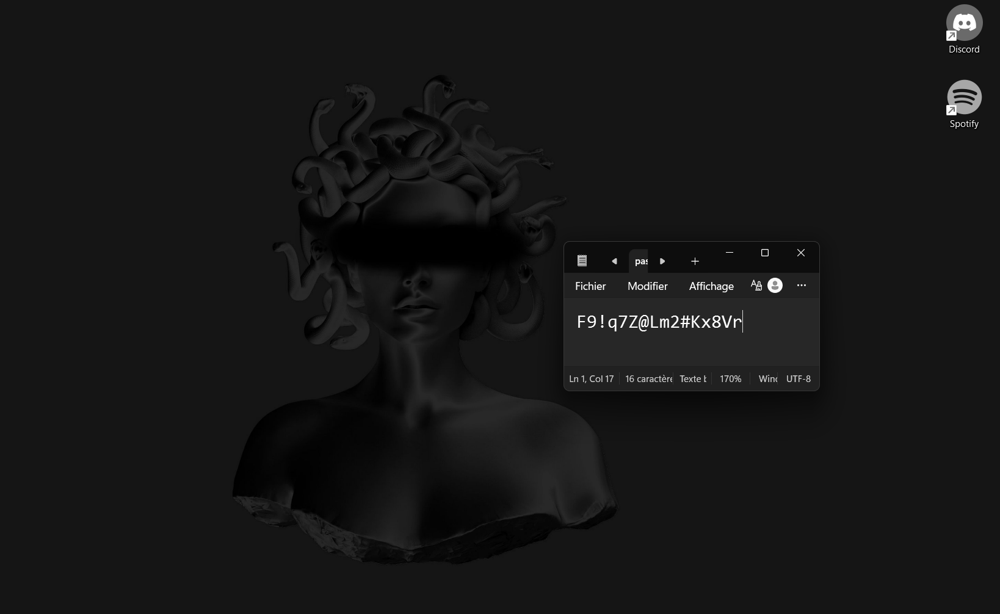
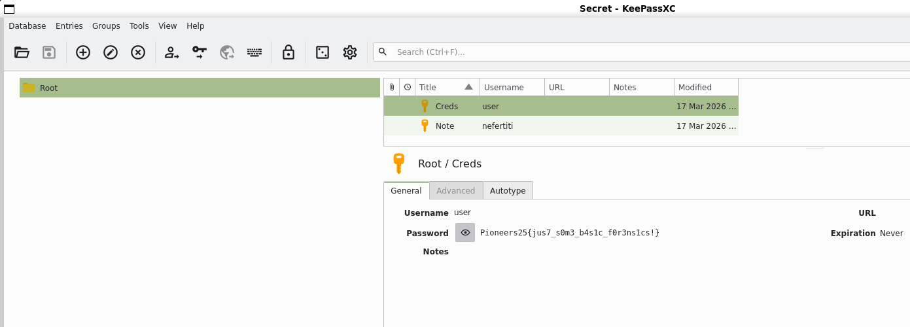

# Helicopter 1

## Challenge Description

We are given three files:

- `Note.txt`
- `Helicopter.wav`
- `Flight.jpg`

> A photo I don’t remember taking, an audio recording that definitely wasn’t intentional, and a note that looks like I smashed the keyboard during turbulence.

---

## Step 1: Analyze `Note.txt`

The note contains a long hexadecimal string.

The first thing to do is convert that hex into raw bytes and save it as a file:

```bash
xxd -r -p Note.txt > note.bin
```

Once converted, the resulting file does not look like plain text or a common document. After testing its type and inspecting its structure trying different possible encrypted file types, we find it is actually a **KeePass database** file (`.kdbx`).

So at this point we know:

- we have a KeePass database
- we need its **master password**
- and possibly a **key file** as well

---

## Step 2: Analyze `Helicopter.wav`

The `.wav` file is suspicious. Instead of containing useful audio, it may actually hide another file or represent raw data.

Using `soxi` gives us the following information:

```bash
soxi Helicopter.wav
```

Output:

```text
Input File     : 'Helicopter.wav'
Channels       : 1
Sample Rate    : 8000
Precision      : 8-bit
Duration       : 00:03:25.98 = 1647828 samples ~ 15448.4 CDDA sectors
File Size      : 1.65M
Bit Rate       : 64.0k
Sample Encoding: 8-bit Unsigned Integer PCM
```

The important value here is the total number of samples:

1647828 samples

If the file is not really meant to be audio, these samples may represent raw pixel values from an image.  
So the idea is to factorize the sample count and try plausible image dimensions.

After testing multiple width/height combinations, the dimensions that reconstruct the image correctly are:

1638 x 1006

### Recovering the image

A simple way to do that is to strip the WAV header and treat the remaining bytes as raw grayscale image data.

```bash
tail -c +45 Helicopter.wav > raw.img
convert -size 1638x1006 -depth 8 gray:raw.img recovered.png
```

Once reconstructed, we get an image containing a password: "F9!q7Z@Lm2#Kx8Vr"



---

## Step 3: Try the recovered password on the KeePass database

Now we use the recovered password to open the `.kdbx` database obtained from `Note.txt`.

However, the password alone is not enough.

That strongly suggests the database also requires a **key file**.

---

## Step 4: Use `Flight.jpg` as the key file

The only remaining file is `Flight.jpg`.

Since the database password alone does not work, the next logical step is to try `Flight.jpg` as the KeePass key file.

This works.

So the correct combination is:

- Password: "F9!q7Z@Lm2#Kx8Vr" recovered from the hidden image in `Helicopter.wav`
- Key file: `Flight.jpg`

With both provided, the KeePass database unlocks successfully.

---

## Step 5: Retrieve the flag

After opening the database, we can read its contents and obtain the flag.




---

## Final Flag

    Pioneers25{{jus7_s0m3_b4s1c_f0r3nslcs!}}