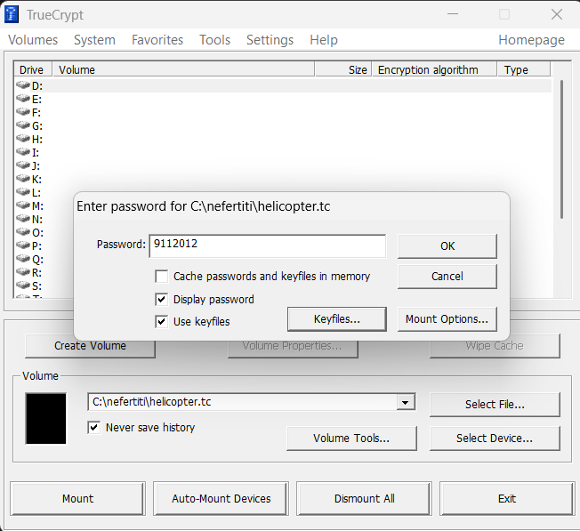
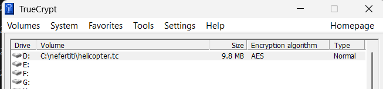
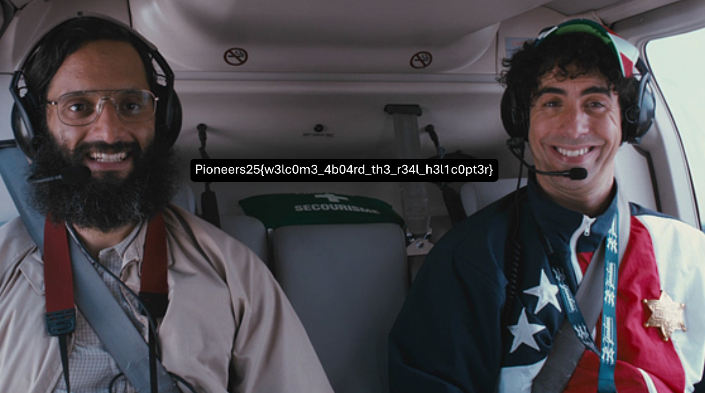

# Helicopter 2

## Challenge Description

We are given two files:

- `blob`
- `Helicopter.mp3`

The goal is to analyze both files, recover any hidden data, and retrieve the flag.

---

## Step 1: Analyze `Helicopter.mp3`

Listening to the audio reveals:

- A man speaking in a strange language
- At the end, a clear number is spoken: **9112012**

This number is likely important and could be a password or key for something.

---

## Step 2: Analyze `blob`

The file `blob` appears to be binary and not directly readable.

Key observation:
- File size is around **10MB**

This strongly suggests that it might be:
- an encrypted container
- or a disk image

A common format for such containers is **TrueCrypt**.

---

## Step 3: Mount the container

We rename the file to use a TrueCrypt extension:

```bash
mv blob Helicopter.tc
```

Then attempt to mount it using TrueCrypt with the password:

```text
9112012
```

However, this fails.

This indicates that:
- the password alone is not sufficient
- a **key file** is likely required

---

## Step 4: Use the audio as a key file

The only remaining file is `Helicopter.mp3`.

We try using it as a **key file** along with the password:

- Password: `9112012`
- Key file: `Helicopter.mp3`



This successfully mounts the encrypted container.



---

## Step 5: Inspect the mounted volume

Inside the mounted disk, we find a **protected archive**.

We attempt to extract it using the known password:

```text
9112012
```

This does not work.

---

## Step 6: Crack the archive password

Since the password is unknown, we need to bruteforce it.

After some time (long time) we get a match. The correct password is:

```text
yellowsunflower
```

---

## Step 7: Retrieve the flag

After extracting the archive, we obtain an image:

```text
helicopterr.png
```

Opening the image reveals the flag:



## Final Flag

```text
Pioneers25{w3lc0m3_4b04rd_th3_r34l_h3l1c0pt3r}
```